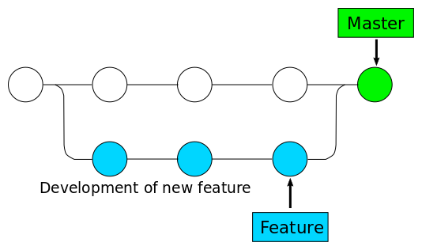

## Improving your daily workflow

Larger projects usually require more complex workflows to manage simultaneous code changes e.g. for different features

* Centralised Workflow <!-- .element: class="fragment" -->
* Feature Branch Workflow <!-- .element: class="fragment" -->
* Gitlabflow Workflow <!-- .element: class="fragment" -->
* Forking Workflow <!-- .element: class="fragment" -->
* Gitflow Workflow <!-- .element: class="fragment" -->

--

### Centralised Workflow

* You are working on your own local copy of a central repository
* Your commits are stored locally
* At some point in time you publish your changes to the central repository

	$ git push origin master

--

#### Managing Conflicts

* Before you can publish new features, the updated central commits need to be fetched to rebase your changes on top

	$ git pull --rebase origin master

* This sometimes requires to resolve merge conflicts manually

--

#### Managing Conflicts (2)

	CONFLICT (content): Merge conflict in <some-file>

* `git` pauses rebasing until you resolve the merge conflicts
* When you are happy with the results, continue the rebasing

	$ git add <resolved file>
	$ git rebase --continue

* Otherwise, you can still abort and you are back where you started

	$ git rebase --abort

--

### Feature Branch Workflow

* Each feature lives in a dedicated branch

	$ git checkout -b <feature> master

* Encapsulation enables developers to work on a particular feature without interfering with main codebase
* Master branch is spared from broken code
* Leveraging of pull requests

--

#### Merging a feature branch

	$ git checkout master
	# create a new commit to retain historical infos
	$ git merge --no-ff <feature>
	# delete the branch after merging
	$ git branch -d <feature>
	$ git push origin master

--

#### Merging a feature branch

--

#### Finishing a feature branch

The merging can also be done based on branches only present on the remote

	$ git checkout master
    # fetch any upstream changes
	$ git pull
	# the actual merge of the new feature
	$ git pull --rebase origin <feature>
	# pushing the master with the feature back to origin
	$ git push
    # deleting the remote feature branch
    $ git push origin --delete <feature>

--

### "Gitlabflow" Workflow

* Strict branching model around the concept of a project release
* Robust framework for management of larger projects
* Master branch as main branch
* Features are developed in dedicated branches and merged in the master
* Dedicated branches for deployment of projects

--

### Forking Workflow

* Distributed workflow
* Not a single server-side repository but one server-side repository for each developer
* Project maintainer can push contents of developer repositories to central repository

--

### Which workflow to choose?

* For me generally a combination of Gitlab and Forking Workflow
    * For larger groups it is easier and more flexible to use forks
* Inclusion of `feature` branches
* No further release or hotfix branches

--

## The Pull Request Workflow

* You create a feature in a dedicated branch in your repository
* You push your finalised branch into a public repository
* You file a pull request
* The team reviews the code, discusses it and eventually files change requests
* The repository maintainer merges the feature into the official repository and closes the pull request

--

## Take-away Messages

* Commit often
* Try not to mix up different things into one commit, make up logical units
* Think about your commit messages
	* Include references to tickets if available (we will come back to this later)

	$ git commit -m "$(curl -sL https://bit.ly/funny-mesg | sh)"

* Branching is cheap
    * Use dedicated branches for each feature

--

## Other important aspects

There are many other aspects which we unfortunately can not cover today

* Keeping the log clear of unnecessary commits
  * Sqashing of multiple commits into a single one
